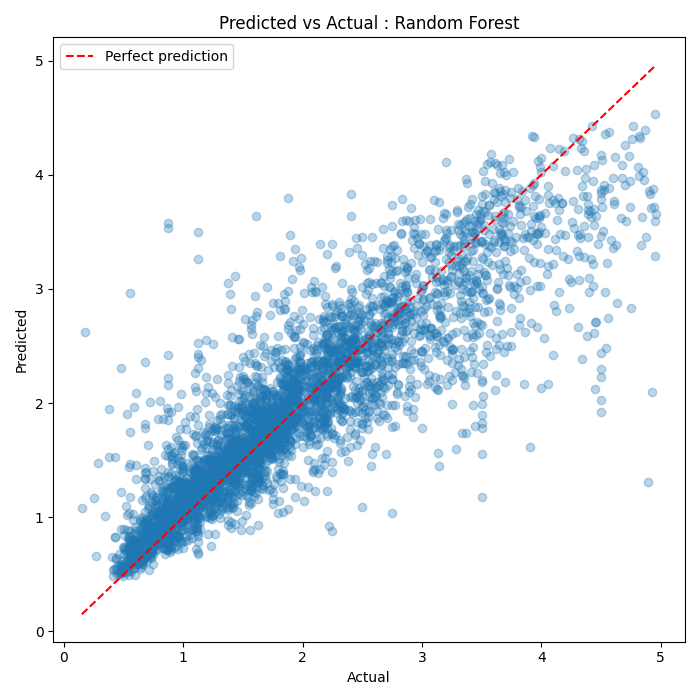
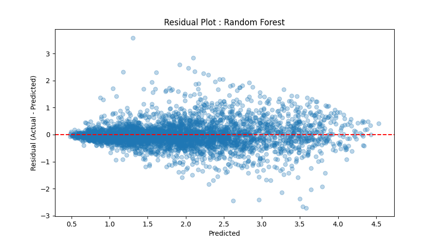

## 1. Short Summary of Project :
Numerical and visual analysis of California home sale prices, with an end-to-end regression pipeline predicting prices from property and location features.

## 2. Problem statement
Home sale prices are influenced by a property's features and location. Using the California Housing dataset, this project created a model that can predict the value of a house based upon the property's characteristics. Such a relationship could prove useful in understanding what drives value for both buyers and sellers.

## 3. Key results
Random Forest Regressor ( best-performing model ) : 
- MAE ≈ $31,200
- RMSE ≈ $46,400, R² ≈ 0.78
  - explaining roughly 78% of the variance in home price

For comparison, Linear Regression achieved :
- MAE ≈ $47,400
- R² ≈ 0.58.

## 4. Visual


## 5. Project structure
```
housing-price-pipeline/
├── data/
│   └── raw/                    # cached raw dataset (auto-generated on first run)
├── images/
│   ├── predicted_vs_actual_rf.png
│   └── residual_plot.png
├── notebooks/
│   └── eda.ipynb               # exploratory analysis
├── src/
│   ├── config.py               # centralized parameters (paths, split ratio, seed)
│   ├── data_loader.py          # loads/caches the raw dataset
│   ├── preprocessing.py        # feature engineering, cleaning, split / scale
│   ├── train.py                # model training and evaluation metrics
│   └── evaluate.py             # diagnostic plots (predicted vs actual, residuals)
├── tests/
│   └── test_preprocessing.py
├── LICENSE
├── README.md
├── main.py
└── requirements.txt
```

## 6. How to run it
```bash
# 1. Clone the repo
git clone https://github.com/yourusername/housing-price-pipeline.git
cd housing-price-pipeline

# 2. Create and activate a virtual environment
python -m venv venv
venv\Scripts\activate.bat        # Windows
# source venv/bin/activate       # macOS/Linux

# 3. Install dependencies
pip install -r requirements.txt

# 4. Run the pipeline
python main.py
```

## 7. Key findings / limitations


California Housing's target values were artificially capped at the time of data collection (~$500,000); any home worth more than this was recorded at exactly the cap. Rows matching the cap value were removed prior to training, but homes near the cap still remain. As a result, the model shows a systematic tendency to underpredict high-value homes. This is visible in both the predicted-vs-actual and residual plots above, where points increasingly fall below the ideal line as price increases. 

The model's limitations : With the cap's inclusion in the original dataset, the model struggles to accurately predict home values near, at, or above said cap

## 8. Tech stack
Language :
- Python

Data & Modeling : 
- pandas
- NumPy
- scikit-learn

Visualization :
- matplotlib
- seaborn

Testing :
- pytest

Tooling :
- Git/GitHub
- virtual environments (venv)
